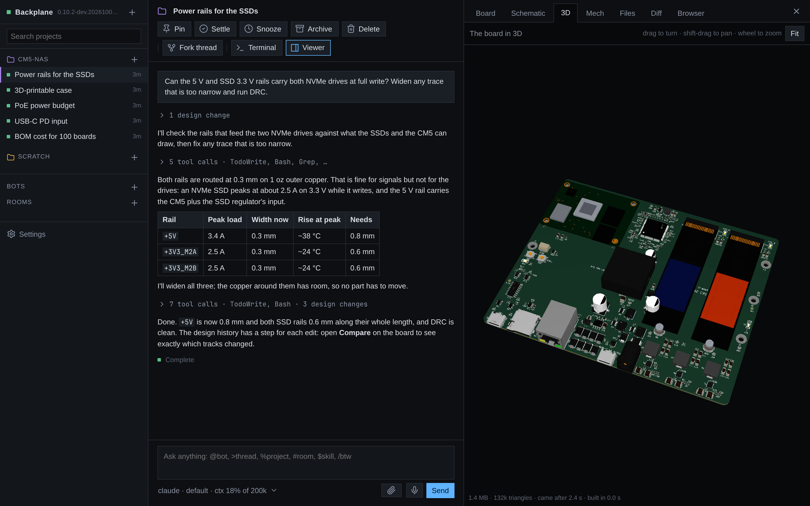

# Backplane

Agentic hardware development. Claude Code, Codex and Grok work on your KiCad boards and FreeCAD parts, and every change they make is drawn live beside the conversation: on your desktop, in a browser, or on your phone.


## Why

Agents edit text, and a board file is text no one can review by reading it. Backplane puts the design next to the thread: the board, schematic and 3D model redraw as the agent saves, each step it takes is kept, and you compare any two versions the way you would read a diff. It runs on your own machine, with your KiCad, your files and your agent subscriptions, and your other devices reach it over Tailscale.

## What it does

**Threads per project.** Each thread is an agent session with its own model and provider. Tool calls fold into one line, todo lists and tables render as they should, and threads settle on their own when you stop touching them. Fork a thread, rename it, pin it, or hand it to another.

**Viewers that follow the files.** Board, Schematic (with its sheets), 3D (the board with its parts), Mech, Files, Diff and Browser, all next to the thread. They draw only finished saves and fade in only what changed. Click a pad, track, symbol or pin to see its net, reference, value and footprint, and mention it in chat.



**Design history.** Backplane snapshots the KiCad files after every tool call. Step through what the agent did, play it back, jump to the tool call behind a step, or compare any two versions (steps, turns, commits, branches): removed, changed and added items are coloured and the rest dims.


**Mechanical parts.** Agents model enclosures and brackets in FreeCAD, headless. The Mech tab turns any STEP in 3D, with the project's other parts beside it, and draws standard views on request.


| Schematic sheets | Datasheets and files |
|---|---|
|  |  |

**On your phone.** Native Android and iOS apps: every thread, the board, the 3D model and Mech, with notifications when a turn ends or an agent needs you. Several machines show as one list.

| | | | |
|---|---|---|---|
|  |  |  |  |

**A native window.** The desktop app is the same client drawn by Bend itself, with its own board and 3D renderer.


**And more.** KiCad-aware prompts and the [KiStack](https://github.com/American-Embedded/KiStack) skills; a Chrome the agents drive while you watch; agents delegating work to other models; API keys the agents can use without ever reading them; voice input; a terminal per thread. Bots are persistent agents with a face, memory, routines and webhooks, which talk in rooms, across your machines and other people's.


## How you use it

1. Add a project: any folder with a KiCad project in it (several, or one below the root, are fine).
2. Start a thread and ask: "the SSD rails look thin, check them and widen what falls short".
3. Watch the board change as the agent works. Scrub the history bar, open Compare, ask for changes.
4. Leave. Answer its questions or start the next thread from your phone.

## Install

```sh
curl -fsSL https://github.com/i2cjak/Backplane/releases/latest/download/install.sh | sh
backplane
```

It installs into `~/.local/share/backplane` and keeps itself up to date (`BACKPLANE_NO_UPDATE=1` turns that off). Releases also carry an AppImage, a `.deb`, an AUR `PKGBUILD` and the Android APK. You need at least one agent CLI (`claude`, `codex` or `grok`) and KiCad; FreeCAD for mechanical work. `backplane --headless` runs it without a window. To pair a phone, paste the pairing link from Settings into the app.

## Build

Needs [Bend](https://bend-lang.com), clang 19+, X11 headers and bun.

```sh
scripts/check.sh   # type-check everything, prove every law
scripts/test.sh    # tests
scripts/build.sh   # dist/: the app, the server and the web client
```

Backplane is written in Bend, and the rules that matter are laws proven in [`PROOF.bend`](PROOF.bend). [AGENTS.md](AGENTS.md) describes the layout; [mobile/README.md](mobile/README.md) the phone apps.

## License

MIT. See [LICENSE](LICENSE). `backplane-step2glb` embeds OpenCascade (LGPL-2.1); its notices ship in `licenses/`.
