# Backplane

Agentic hardware development. Claude Code, Codex and Grok work on your KiCad boards and FreeCAD parts, and every change they make is drawn live beside the conversation, in a browser, on your phone, or in the desktop app.

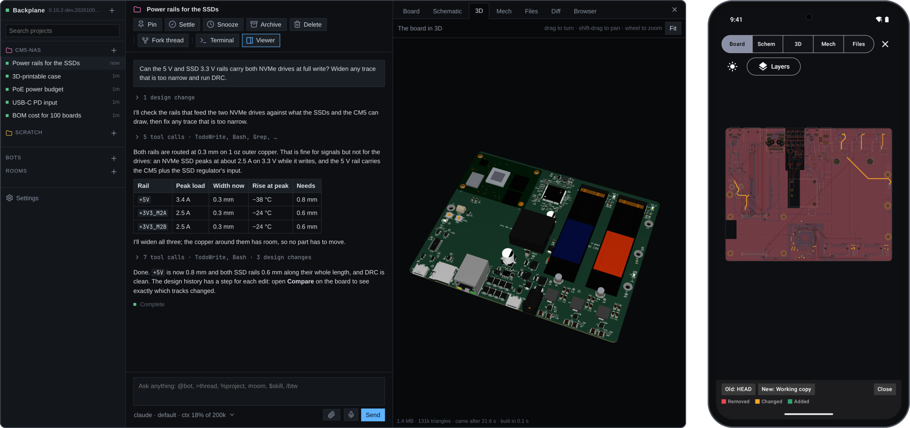

## Why

- **Agents that know KiCad.** Each one is told the exact `kicad-cli` and the project's canonical files, and gets the [KiStack](https://github.com/American-Embedded/KiStack) skills: schematics, symbols, footprints, layout, BOM, Gerbers, panelizing and product renders, kept up to date.
- **You see what the agent changed.** A board file is text no one can review by reading it. Here the board, schematic and 3D model redraw as the agent saves, every step is kept, and any two versions compare like a diff.
- **Mechanical in the same loop.** Agents model enclosures and brackets in FreeCAD from the board's real outline and parts, and the Mech tab shows them in 3D beside the board.
- **Your machine, your tools.** It runs locally with your KiCad, your FreeCAD, your files and your agent subscriptions: Claude Code, Codex or Grok.
- **Away from the desk.** The browser and the phone apps reach it over Tailscale: follow a turn, answer its questions and review the board from anywhere.

## Web and phone, the same work

The hub runs on your machine. The browser and the native Android and iOS apps reach it over your tailnet and show the same threads, live: start a turn at your desk, then follow it, answer its questions and review the board from your phone. The phone apps are not a reduced view: threads, the board, schematic, 3D model, Mech parts, files and the design history with Compare are all there, drawn natively, with a notification when a turn ends or an agent needs you. Several machines show as one list.

| | | | |
|---|---|---|---|
| 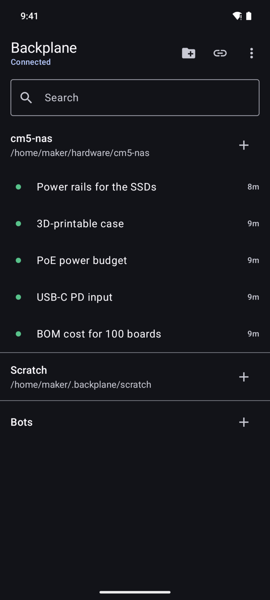 | 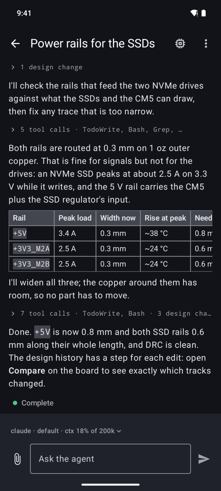 | 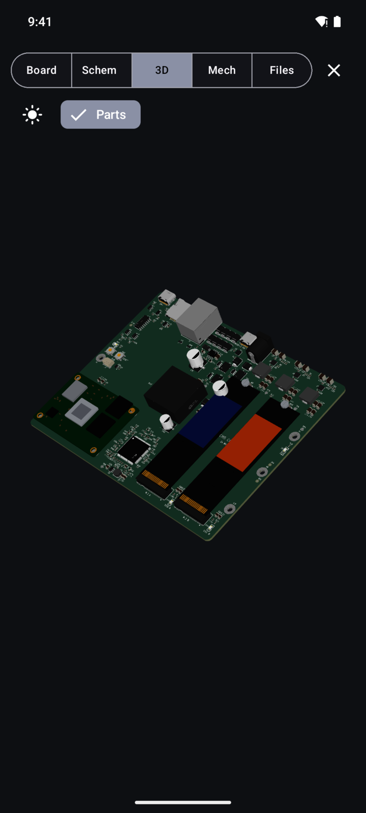 | 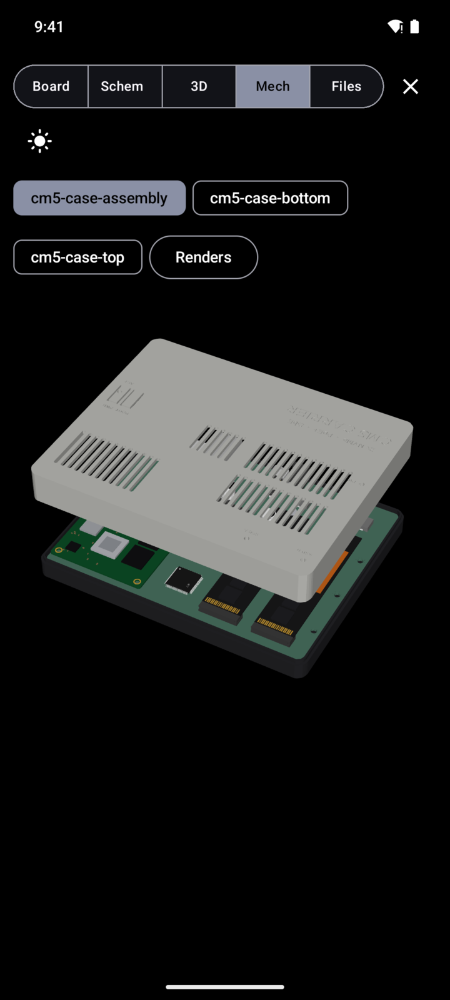 |

## What it does

**Viewers that follow the files.** Board, Schematic (with its sheets), 3D (the board with its parts), Mech, Files, Diff and Browser, all next to the thread. They draw only finished saves and fade in only what changed. Click a pad, track, symbol or pin to see its net, reference, value and footprint, and mention it in chat.

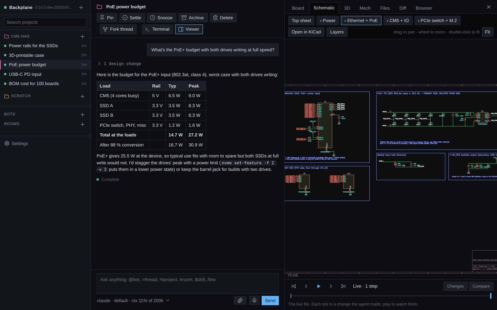

**Mechanical parts.** Agents model enclosures and brackets in FreeCAD, headless. The Mech tab turns any STEP in 3D, with the project's other parts beside it, and draws standard views on request.

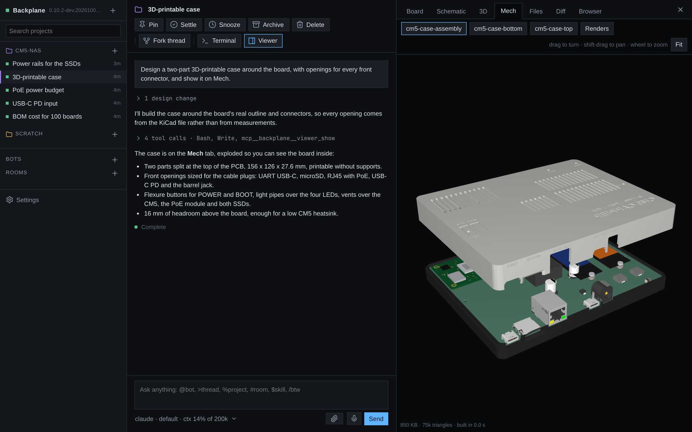

**Design history.** Backplane snapshots the KiCad files after every tool call. Step through what the agent did, play it back, jump to the tool call behind a step, or compare any two versions (steps, turns, commits, branches): removed, changed and added items are coloured and the rest dims.

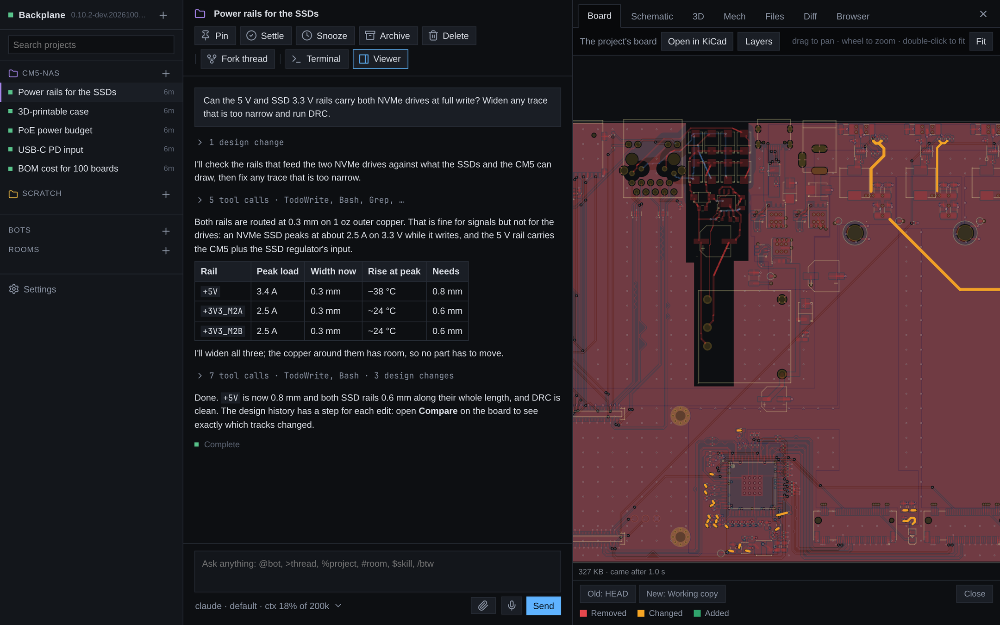

**Threads per project.** Each thread is an agent session with its own model and provider. Tool calls fold into one line, todo lists and tables render as they should, and threads settle on their own when you stop touching them. Fork a thread, rename it, pin it, or hand it to another.

| The board | Datasheets and files |
|---|---|
| 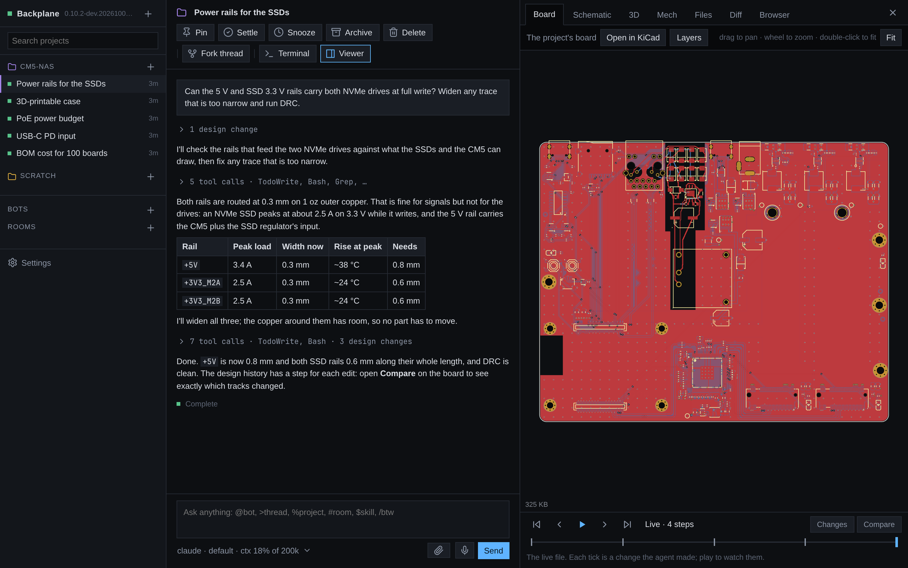 | 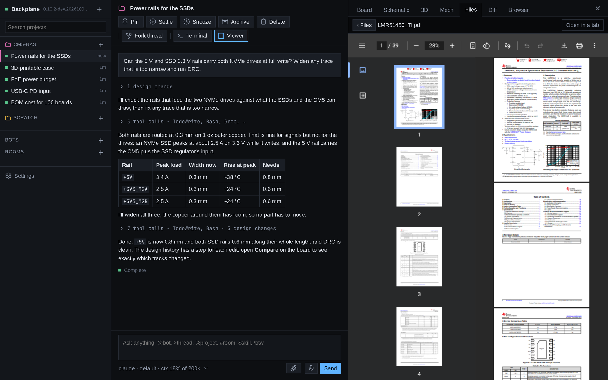 |

**A native window.** The desktop app is the same client drawn by Bend itself, with its own board and 3D renderer.

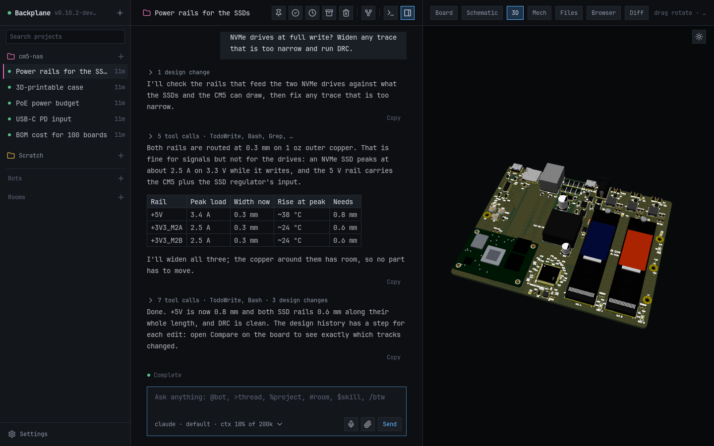

**And more.** A Chrome the agents drive while you watch; agents delegating work to other models; API keys the agents can use without ever reading them; voice input; a terminal per thread. Bots are persistent agents with a face, memory, routines and webhooks, which talk in rooms, across your machines and other people's.


## How you use it

1. Add a project: any folder with a KiCad project in it (several, or one below the root, are fine).
2. Start a thread and ask: "the SSD rails look thin, check them and widen what falls short".
3. Watch the board change as the agent works. Scrub the history bar, open Compare, ask for changes.
4. Leave. Answer its questions or start the next thread from your phone.

## Install

```sh
curl -fsSL https://github.com/i2cjak/Backplane/releases/latest/download/install.sh | sh
backplane
```

It installs into `~/.local/share/backplane` and keeps itself up to date (`BACKPLANE_NO_UPDATE=1` turns that off). Releases also carry an AppImage, a `.deb`, an AUR `PKGBUILD` and the Android APK. You need at least one agent CLI (`claude`, `codex` or `grok`) and KiCad; FreeCAD for mechanical work. `backplane --headless` runs it without a window. To pair a phone, scan the QR code in Settings (Pairing link, QR code) with the app, or paste the pairing link.

## Build

Needs [Bend](https://bend-lang.com), clang 19+, X11 headers and bun.

```sh
scripts/check.sh   # type-check everything, prove every law
scripts/test.sh    # tests
scripts/build.sh   # dist/: the app, the server and the web client
```

Backplane is written in Bend, and the rules that matter are laws proven in [`PROOF.bend`](PROOF.bend). [AGENTS.md](AGENTS.md) describes the layout; [mobile/README.md](mobile/README.md) the phone apps.

## License

MIT. See [LICENSE](LICENSE). `backplane-step2glb` embeds OpenCascade (LGPL-2.1); its notices ship in `licenses/`.
